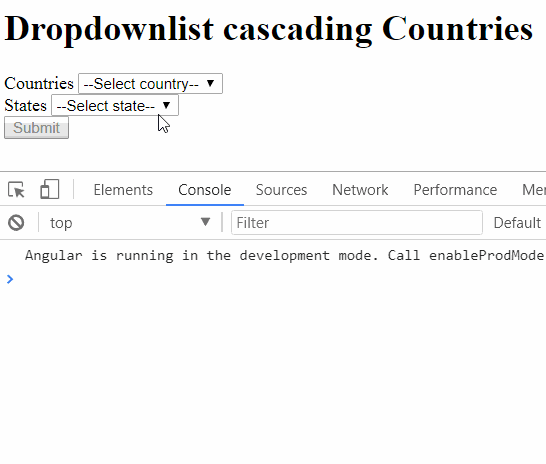

# Dropdownlist Cascading

Proyecto que utiliza Angular 5 y demuestra el uso del tag de HTML ```<select>``` en forma de cascada, mejor conocido como ```dropdownlist cascading```

## Ejecución del proyecto
Ya que este proyecto fue creado con Angular - CLI, la forma de ejecutarlo es la misma que la documentación del CLI
```
ng serve
```

## Comportamiento del proyecto
El proyecto consta de dos ```<select>``` o listas, la primera lista despliega una conjunto de paises y según el país seleccionado en la primera lista, el segundo ```<select>``` se llena automaticamente con los estados relacionados a dicho país.

|Pais|Estado|
|----|------|
|1 United States| 1 Alabama|
||2 Alaska|
||3 Arizona|
|2 India|1 New Delhi|
||2 Maharashtra|
||3 Goa|
|3 Australia|1 New South Wales|
||2 Tasmania|
||3 Qweensland|

La logica de la selección se basa en obtener los paises desde un servicio y relacionarlas con el primer ```<select>```, elemento creado de forma reactiva, o [reactive forms](https://angular.io/guide/reactive-forms).  Este primer ```<select>``` tiene un subscribe adjunto al evento de cambio del valor del pais seleccionado, lo que dipara la seleccion de estados según la selección de paises.

Finalmente se utiliza un botón para hacer el envío del formulario que en este caso será la selección de Pais y Estado, enviadolo a la consola para comprobar que la información seleccionada fue la correcta.



### Creado por @leojim06 
